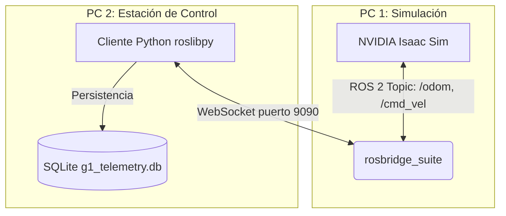

# 🤖 Integración G1 EDU (NVIDIA Isaac Sim)

Este repositorio contiene la implementación del puente de comunicación interactivo (ROS 2 Bridge) para monitorear y controlar el robot humanoide **G1** simulado dentro del entorno **NVIDIA Isaac Sim**. 

El proyecto establece una comunicación fluida entre el motor de físicas de la simulación y una interfaz de control externa mediante WebSockets, permitiendo recopilar telemetría y enviar comandos de velocidad sin requerir instalaciones pesadas de ROS 2 en los sistemas clientes.

---

## 🏗️ Arquitectura del Sistema

El sistema emula un escenario del mundo real donde el simulador (Isaac Sim) actúa como el hardware físico del robot, y una PC o laptop remota funciona como la "Estación de Control Terrestre" (GCS).



**Componentes Clave:**
1. **ROS 2 via Rosbridge**: Utilizado para exponer los tópicos del G1 mediante WebSockets en lugar de depender exclusivamente del sistema de descubrimiento nativo de DDS (Data Distribution Service).
2. **Cliente Remoto (`roslibpy`)**: Permite que máquinas ligeras (como laptops sin Ubuntu/ROS 2 nativo) puedan suscribirse y publicar tópicos comunicándose directamente con el puerto 9090 del servidor.
3. **Persistencia (SQLite)**: Almacenamiento local ultraligero para guardar históricos de posición y trayectoria, aplicando técnicas de "throttling" para no saturar los discos con la alta frecuencia de publicación de la simulación (ej. 100Hz).
4. **Backend (Próximamente FastAPI)**: Para exponer los datos de telemetría a una interfaz web y permitir el control Joystick asíncrono.

## 📁 Estructura del Repositorio

El proyecto se desarrolla en fases iterativas. La estructura actual es la siguiente:

```text
g1_challenge/
├── ros2_ws/                 # Workspace ROS 2 (si aplica para scripts nativos)
│   └── src/
│       └── g1_monitor/      # Paquete de telemetría y lógica
├── docs/                    # Documentación detallada de cada fase
│   ├── FASE_1.md            # Inmersión en ROS 2 y Mapeo de Tópicos
│   ├── FASE_2.md            # Capa de Persistencia con SQLite
│   ├── FASE_3.md            # Integración de ROS API y Foxglove Bridge
│   └── README.md            # Índice de la documentación
├── database/                # Archivos SQLite (g1_telemetry.db)
└── README.md                # Este archivo
```

## 📖 Documentación por Fases

El desarrollo se ha dividido en fases lógicas para asegurar una integración robusta:

- 📘 **[Fase 1: Inmersión en ROS 2 (Suscripción y Publicación)](docs/FASE_1.md)**: Cómo logramos escuchar la odometría del G1 (tópico `/odom`) y enviarle comandos matemáticos de velocidad diferencial (tópico `/cmd_vel`).
- 🗄️ **[Fase 2: Capa de Datos (SQLite)](docs/FASE_2.md)**: Diseño de la base de datos para la telemetría, implementando un guardado eficiente (Throttling) para prevenir bloqueos por alto volumen de datos.
- 🌐 **[Fase 3: Transmisión Web y Sensores](docs/FASE_3.md)**: Integración de `rosapi` y `foxglove_bridge` para exponer la estructura de ROS 2 y transmitir video/nubes de puntos hacia visualizadores remotos.
- 🛠️ **[Guía de Scripts de Monitoreo](docs/GUIA_SCRIPTS.md)**: Explicación de todas las herramientas de diagnóstico desarrolladas para LiDAR, Odometría y conectividad.

## 🚀 Despliegue Rápido (Entorno Multi-PC)

Dado que es común correr Isaac Sim en una PC con GPU dedicada y monitorearlo desde una Laptop:

### Prerrequisitos en el dispositivo con el simulador (Host)
1. Instalar y arrancar **NVIDIA Isaac Sim** (con el entorno del robot G1 cargado).
2. Asegurar que los puentes de ROS 2 en la simulación estén activos (Action Graphs publicando en `/odom` y escuchando en `/cmd_vel`).
3. Instalar y lanzar `rosbridge_server` (usualmente puerto `9090`):
   ```bash
   sudo apt install ros-humble-rosbridge-suite
   ros2 launch rosbridge_server rosbridge_websocket_launch.xml
   ```

### Prerrequisitos de Control
1. Conocer la Dirección IP de la PC host (ej. `192.168.1.100`).
2. Configurar el script de conexión (`odom_subscriber.py` o backend) apuntando a dicha IP.
3. Instalar dependencias puras de Python (sin necesidad de instalar todo ROS 2 localmente):
   ```bash
   pip install roslibpy
   ```

*(Nota: Si ambas máquinas tienen instalación completa de ROS 2, asegurarse de exportar la misma variable `ROS_DOMAIN_ID` en ambas terminales para que se "vean" en la red local).*
